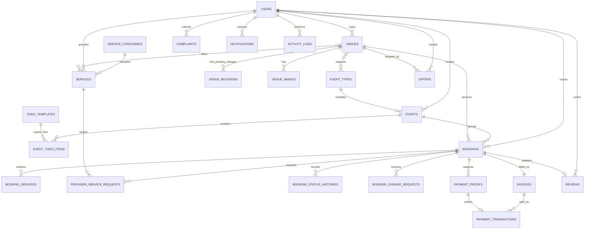

# Salora ERD — University Edition

## ملاحظات

- `EventTodoItem` نسخة مستقلة من `TodoTemplate` كي يستطيع العميل تخصيصها دون تغيير القالب الإداري.
- تعديل الصالة المنشورة يُحفظ في `VenueRevision` حتى موافقة Admin.
- `Invoice` واحدة لكل Booking في النطاق الجامعي الحالي.
- `PaymentTransaction` يسجل قرار إثبات التحويل اليدوي، مع إمكانية إضافة Gateway Adapter مستقبلاً.
